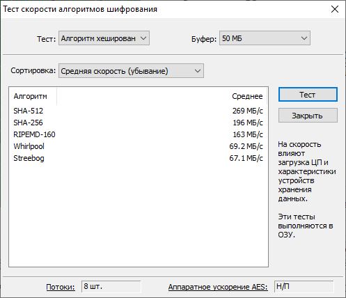
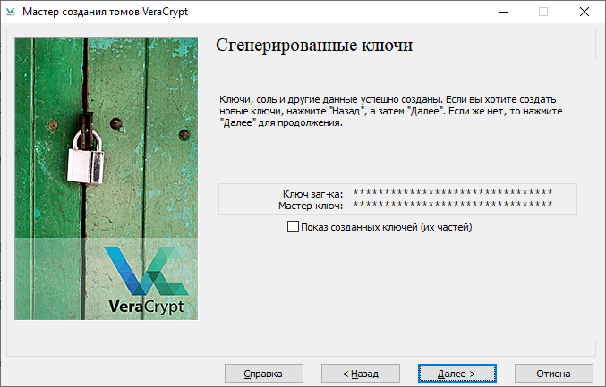
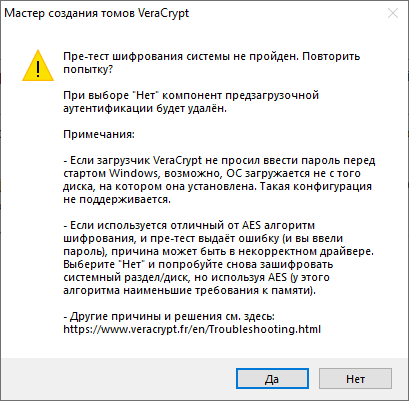

# Шифрование диска с помощью Veracrypt. Расширенный гайд.

Вы скажете что в интернете уже есть 100 и 1 статья на эту тему, и я соглашусь с вами. Я провел короткий ресерч, в ходе которого обнаружилось, что большинство этих статей задействует стандартные настройки Veracrypt, которых, по-моему мнению, скоро может не хватить.

Технологии развиваются, и если у злоумышленника имеются значительные вычислительные мощности (а это уже не кажется таким заоблачным сценарием), то нам придется подстраиваться.
Сегодня я расскажу, как мы будем это делать. Bтак, представляю вам "Расширенный гайд по шифрованию диска с Veracrypt", погнали:

> Этот материал основан на статье Олега Афонина "Как укрепить «Веру». Делаем шифрованные контейнеры VeraCrypt неприступными". Если вы хотите углубиться в тему ИБ, то не скупитесь на статью и подпишитесь на него.

## Это важно
Есть некоторая вероятность, что ваш процессор не поддерживает технологию ускоренной расшифровки AES. Это будет означать что расшифровка вашего диска (то есть время от введения пароля до начала загрузки windows) будет занимать в разы больше времени. То есть вместо секунды вы можете потратить 4 минуты.

Чтобы проверить наличие данной технологии, после установки Veracrypt зайдите в Сервис -> Тест скорости... Нас интересует показатель в правом нижнем углу. Если его надпись совпадает с показанной на картинке, значит ваш судьба обделила ваш процессор и вам суждено каждый раз тратить 4 минуты своей жизни на загрузку.

## Установка
Я качал с официального сайта. Заходим на вкладку Downloads, выбираем версию (Installer for) для своей операционной системы, я выбрал Windows.

Далее открываем скачанный файл и начинаем установку. Тут все просто, подтверждаем все пункты пока не установим программу.
Перезагружаем компьютер.

## Эксплуатация
После перезагрузки открываем Veracrypt и создаем новый том. В открывшемся мастере создания томов мы делаем следующее:
1. Выбираем "Зашифровать раздел или весь диск с системой"
1. Тип шифрования - обычный
1. Область шифрования - на выбор две опции "системный раздел Windows" или "весь" диск. Если у вас доступна вторая, то выбираем ее.
1. Число операционных систем - одиночная загрузка

## Шифрование
И тут мы переходим к самому интересному, методам шифрования.

В качестве алгоритма мы выбираем проверенный временем AES, а вот с хэшированием уже посложнее.

Дело в том, что Veracrypt не шифрует жесткий диск вашим паролем (который мы настроем чуть позже). Ваш пароль проходит 2 этапа преобразования, после чего сгенерированной последовательностью шифруется диск. И в данном случае от выбора алгоритма хэширования зависит только скорость расшифровывания нашего пароля, а это в свою очередь напрямую влияет на время загрузки системы.

Как мы видим на картинке выше, sha-512 (скорее всего будет стоять у вас по умолчанию) имеет самую высокую скорость расшифровки и не отвечает нашим запросам. И здесь уже каждый сам сделаем свой выбор, либо мы выбираем скорость, либо безопасность. Лично я советую выбирать из середины, например Whirlpool или RIPEMD-160 

> Внимание, не при каких условиях не выбирайте Streebog, данный алгоритм содержит дыру в безопасности

Далее идет выбор пароля. Подробнее о том из чего состоит хороший пароль вы можете найти в нашей статье. От себя посоветую ставить УНИКАЛЬНЫЙ ПАРОЛЬ, т.к. корпорации хранят все ваши пароли (даже прошлые) на серверах. Один запрос правоохранительных органов и все ваши пароли окажутся у них в руках.

Ставим галочку "Использовать PIM" и идем дальше.

## PIM (Personal Iterations Multiplier)
Нас попросят ввести PIM, там же приводится описание данного термина. Чем больше - тем безопаснее. Подождать лишние секунды при загрузке не сложно, а нам полезнее.

Чтобы у вас сложилось понимание, представим что даже если злоумышленник знает пароль, ему придется перебирать все вариации PIM, то есть (1,2,3 ... n) чтобы расшифровать диск. И если не знать точного числа, то можно застрять надолго, что играет нам в плюс.
Но даже при высоком значении стоит выбирать номер очень аккуратно. То есть комбинации аля 1234 / 2012 / 1939 / год рождения ребенка/поступления/совершеннолетия сразу отбрасываем. Число никак не должно быть связано с вами, и при этом не быть слишком тривиальным. 

Итак, PIM должен быть большим, анонимным и нетривиальным. Я выберу 1819 (число приведено для примера).

Нам предложат сгенерировать дополнительные ключи, нам они не требуются, нажимаем далее.

Затем последует предложение по созданию диска восстановления. Вряд ли он нам когда-нибудь пригодится, случаи повреждения загрузчика довольно редки, но тем не менее советую закинуть его на флешку, чтобы в будущем избавить себя от потенциальной головной боли.

Далее идет режим очистки. Описание данное самой программой я считаю достаточным, лишь отмечу что я выбрал 3 прохода.

## Пре-тест
Теперь когда мы выполнили все необходимые настройки нам остается лишь сделать пре-тест, в ходе которого компьютер перезагрузится, но вместо привычного значка windows нас поприветствует холодный интерфейс шифровальщика, который попросит ввести пароль и PIM, что мы и делаем.

Для особых случаев (например если вы резко забыли пароль и PIM придуманные 5 минут назад) существует механизм обхода ввода пароля. Нажимаем на ESC и загружаемся в windows. Veracrypt уведомит нас что пре-тест провалился и предложит пройти его снова. Мы от предложения отказываемся. И повторяем весь процесс сначала.

В случае успешного входа нас встретит veracrypt с оповещением, что пре-тест выполнен успешно, и нам остается лишь зашифровать диск, что мы и делаем, нажав encrypt, после чего откидываемся на минут 15 и ждем 

# Вы сделали это. Вы - Молодец.
Но на этом наша статья не кончается, я хотел бы рассказать о некоторых деталях, которые, по-моему мнению, вам было бы полезно знать.

# За раз шифруется только 1 диск
В данной статье мы шифровали только системный, в том случае если у вас имеются дополнительные, вы повторяете все те же действия указанные ранее. В таком случае для доступа к этому диску вам каждый раз придется заходить в Veracrypt чтобы размонтировать диск и получить к нему доступ. От себя я бы советовал просто не держать на втором диске важной информации и не парится с шифрованием.

@Дополнить@
